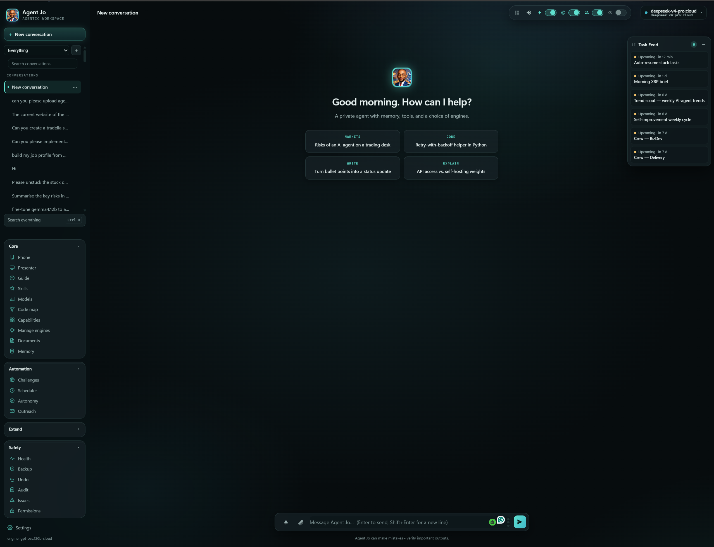

# Agent Jo

**An AI agent that runs on your own machine.** Not a chat window with an API
behind it — it reads your files, runs commands, drives a browser, applies for
jobs, and keeps working while you're away from the desk.

Conversations, documents, memory and audit trail stay on the machine it's
installed on. Point it at a local model and nothing leaves at all.

*by Symbolic Synapse*

## Demo



---

## What it actually does

**Works unattended.** Scheduled runs with circuit breakers, a watchdog that
notices when a feature has gone quiet, and a tamper-evident audit trail of
everything it did. It tells you where it stopped and why.

**Applies for jobs, properly.** Reads job boards and the alert emails those
boards send, de-duplicates the same role listed three times, screens out
obvious mismatches with a free local check, scores what's left, drafts an
application — and **holds any draft that claims something your profile can't
support**. Then it learns: which sources actually produce replies, whether its
own fit score predicts anything, whether email beats a portal form.

**Reads what you give it.** PDF, Word, Excel, PowerPoint, OpenDocument, HTML,
email, EPUB. Retrieval over your own documents, locally.

**Runs any model.** Anthropic, OpenAI-compatible endpoints, or Ollama on your
own GPU. Rules-based routing sends light work to a local model and hard work
to the strong one — and tells you which rule fired. It can fine-tune a local
model for a domain, and refuses to register the result unless it beats the
model it started from.

**Maps a codebase.** Point it at a folder: what every module leans on, what
imports what in a circle, what nothing imports at all. Exports to Mermaid,
Graphviz or CSV for Visio.

---

## Two apps

**Agent Jo** — the agent: chat, documents, code map, schedules, the crew.

**Agent Jo Jobs** — the job search, in its own window on port 8766. Roles,
held drafts, auto-apply, and what actually produced replies. Start it with
`start_agent_jo_jobs.bat` (or `./start_agent_jo_jobs.sh`).

They share the data, the engines and the audit trail — the routes moved, they
weren't copied, so there is one fabrication check and one auto-apply engine.
Run both at once; that's the normal case.

## Install

Windows, one click:

```
1. Download the latest release and unzip it
2. Double-click install.bat
```

It finds Python, **asks before installing it** if it's missing, sets up an
isolated environment, checks the download hasn't been tampered with, and puts
a shortcut on your desktop.

macOS — double-click `install.command`.
Linux — `./install.sh`.

Same as Windows: it finds Python (offering Homebrew on a Mac if you have it,
never installing it for you), sets up an isolated environment, and checks the
app actually loads. `--check` surveys the machine without changing anything.

It opens at `http://127.0.0.1:8765`. First run asks for an API key — or point
it at Ollama and it runs entirely offline.

---

## Three things that make it different

**It says what it doesn't know.** Draft applications claiming a tool or an
employer your profile can't support are held, with the exact claim shown, and
you decide. The same principle runs throughout: rates carry confidence
intervals, a partial document index says it's partial, and a fine-tune that
scores worse than its base is reported as worse.

**Consequence, not permission.** Under full access it doesn't prompt for
everything — being asked constantly teaches you to click through without
reading. Reads run. Anything leaving the machine — mail, form submissions, API
posts — waits with its **exact inputs shown**: not "send_email" but *"to
hiring@acme.com · 'Application — Senior Data Engineer' · 1,400 characters"*.

**It can be checked.** 1,235 tests, a tamper-evident audit chain, signed
releases, and an honest [build log](CHANGELOG.md) recording what broke and
why. Most of what's in there was found by running it on a real machine, not by
planning.

---

## Licence

Free for personal, research, educational and non-profit use under the
[PolyForm Noncommercial License 1.0.0](LICENSE).

**Commercial use needs a licence** — running it inside a business, using it for
client work, or bundling it into something you sell. See
[COMMERCIAL.md](COMMERCIAL.md); I'd rather agree something sensible than have
you guess.

## Verifying a download

This runs commands on your machine, so check it's the real thing:

```
python tools/sign.py --verify
```

See [VERIFYING.md](VERIFYING.md). A valid signature proves the copy is
unaltered — it does not stop anyone copying the code, which is what the
licence is for.

---

## Documentation

| | |
|---|---|
| [UPGRADING.md](UPGRADING.md) | Updating an install you already have |
| [CHANGELOG.md](CHANGELOG.md) | How it was built, and what was learned |
| [COMMERCIAL.md](COMMERCIAL.md) | Using it in a business |
| [VERIFYING.md](VERIFYING.md) | Checking a download |
| [SIGNING.md](SIGNING.md) | Signing your own releases |

Built by **Itumeleng Nthite** — Symbolic Synapse, Johannesburg.
